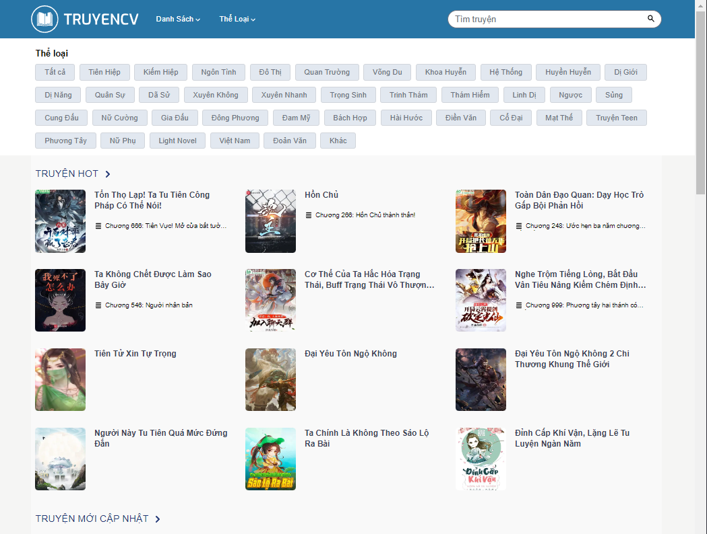
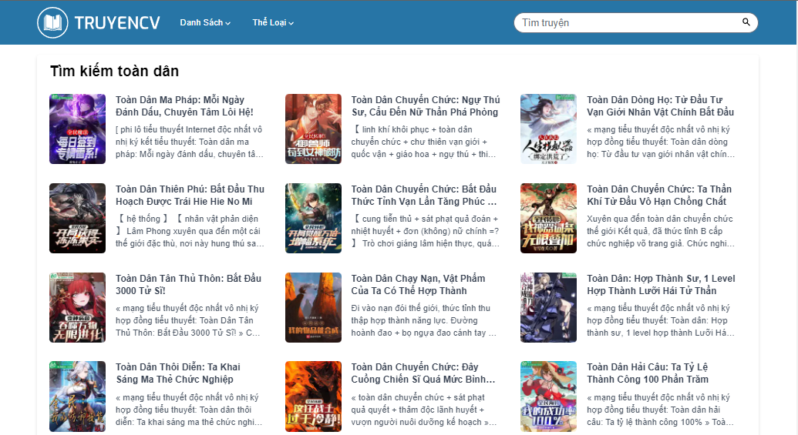
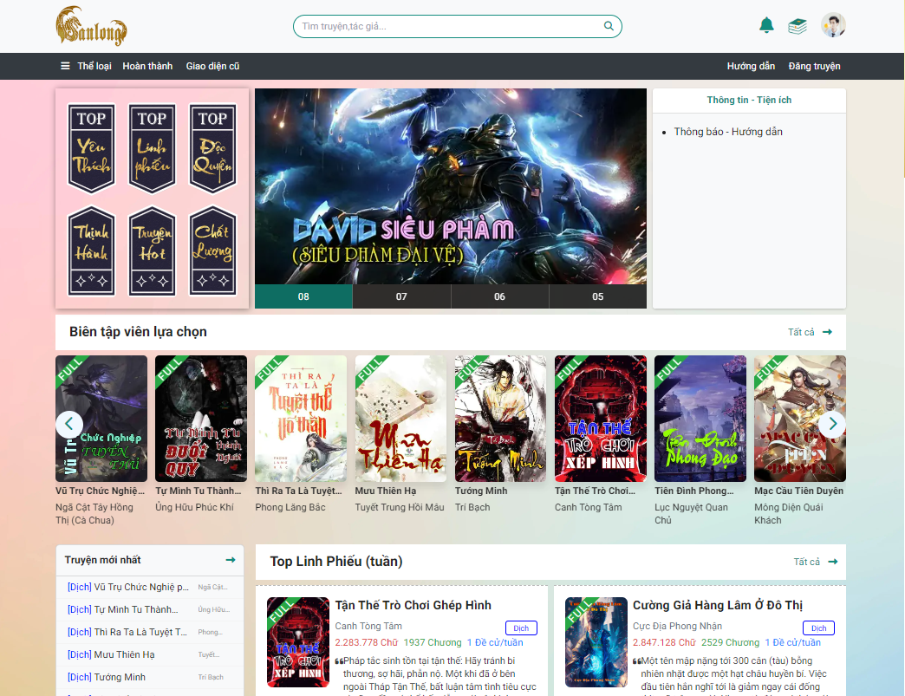
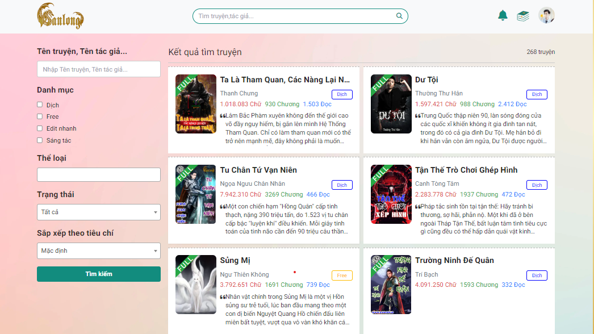
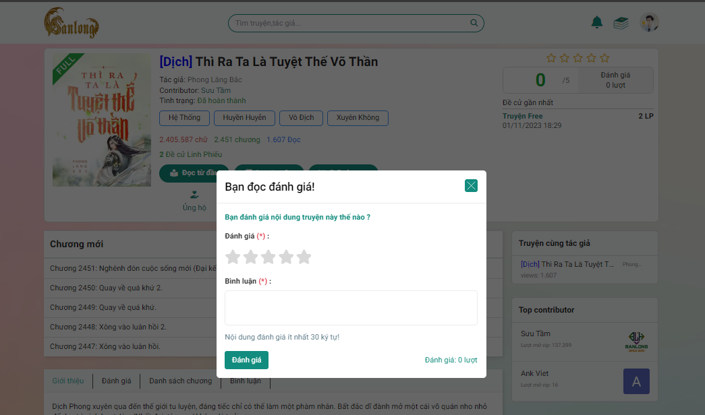
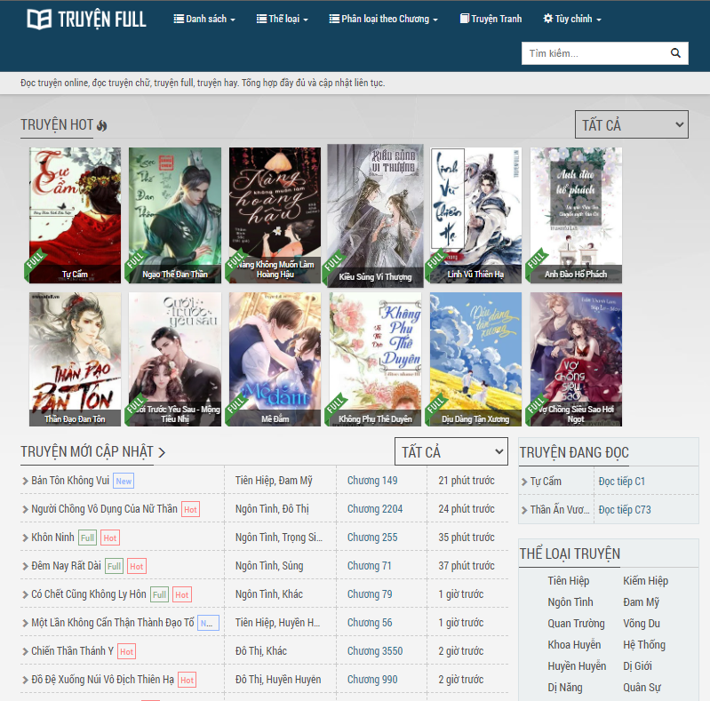
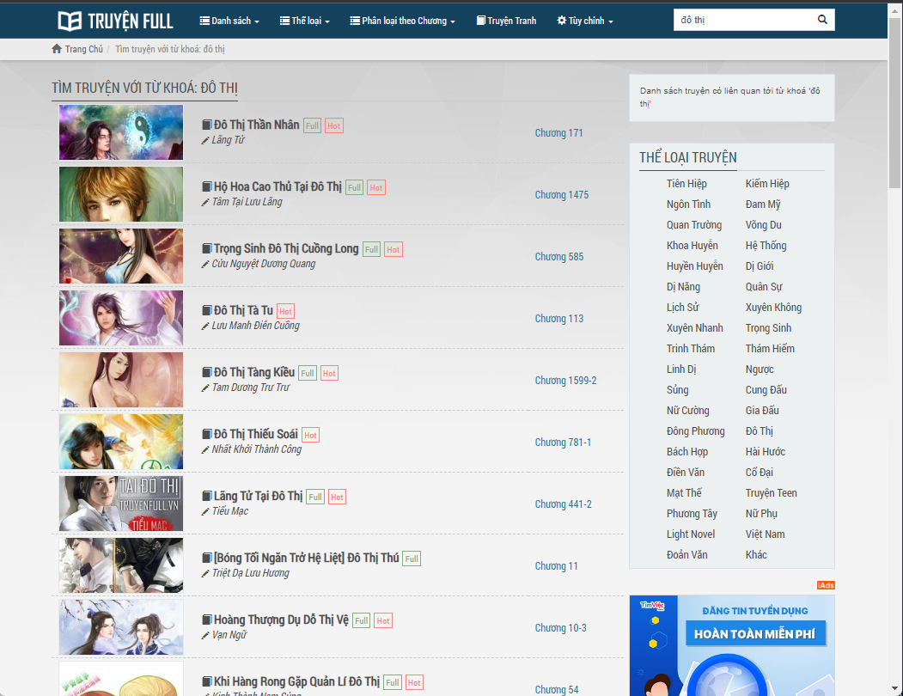

# Giới thiệu

## Đặt vấn đề

- Hiện nay, trong bối cảnh cuộc cách mạng 4.0 và một phần do tác động của đại dịch Covid , làm mọi nhu cầu trực tuyến phát triển mạnh mẽ, đặc biệt là giải trí qua mạng Internet ngày càng phổ biến. Và tất nhiên việc đọc truyện qua mạng cũng ngày càng trở thành xu hướng phổ biến. Người đọc truyện không chỉ tìm kiếm những câu chuyện thú vị, mà còn cần có trải nghiệm đọc truyện tốt hơn, dễ dàng tiếp cận với các tác phẩm mới hay thử nghiệm sáng tác truyện do bản thân sáng tạo và tương tác với cộng đồng đọc truyện.
- Với niềm đam mê đọc truyện kiếm hiệp Kim Dung. Và các tác phẩm khác của ông ấy tôi khá tò mò về xu hướng mới của văn học Trung Quốc. Sau sự bùng nổ của Tru Tiên, thì hàng loạt các tác giả cho ra đời rất nhiều tác phẩm độc đáo. Các tác phẩm mới này không chỉ hay mà còn tạo cảm hứng sáng tác cho rất nhiều tác giả sau này. Và em cũng không ngoại lệ, động lực đó khiến em muốn tạo nên một website Htruyen.
- Và mong muốn được kết nối với nhiều người yêu đọc truyện online, cùng hòa mình vào những câu chuyện, cùng nhau phiêu lưu đến các vùng đất khác nhau trong thế giới ảo. Việc tạo nên website Htruyen sẽ cung cấp các tiện ích giúp người đọc có thể tiếp cận với các tác phẩm mới, từ đó tạo ra nhiều cảm hứng sáng tác để thế giới văn học mạng Việt Nam được phổ biến rộng rãi hơn.

## Mục tiêu và phạm vi đề tài

Mục tiêu của đề tài “**Xây dựng website đọc truyện online**” là xây dựng một website hoàn chỉnh và hiệu quả, mang lại trải nghiệm đọc truyện tốt nhất cho người dùng.với trải nghiệm đọc truyện tốt hơn cho người dùng. Website sẽ có giao diện người dùng thân thiện, tối ưu hóa tốc độ tải trang và tìm kiểm truyện hiệu quả, đồng thời cung cấp tương tác giữa người đọc và cộng đồng đọc truyện. Dưới đây là các mục tiêu chính của đề tài : 
- **Tạo trải nghiệm người dùng**: Mục tiêu hàng đầu của đề tài là đảm bảo website có một giao diện người dùng thân thiện, trực quan và dễ sử dụng. Điều này giúp người dùng dễ dàng tìm kiếm và thưởng thức truyện một cách thuận tiện nhất và đáp ứng nhu cầu đọc truyện của họ. 
- **Hỗ trợ đa nền tảng**: Đảm bảo website có khả năng hoạt động trên nhiều nền tảng và thiết bị khác nhau, bao gồm di dộng (Android và iOS) và máy tính các nhân ( Windows và macOS). Điều này giúp tiếp cận nhiều người dùng và cung cấp sự linh hoạt trong việc truy cập website.
- **Thư viện truyện phong phú**: Mục tiêu xây dựng và quản lý thư viện sách đa dạng, bao gồm nhiều truyện từ nhiều nguồn khác nhau. Điều này đảm bảo người dùng có nhiều tùy chọn và lựa chọn để khám phá truyện mới.

## Khảo sát 1 số website đọc truyện online

- **truyencv.org**:

    1.	Giao diện: Giao diện đơn giản, dễ sử dụng. Các chức năng được bố trí hợp lý, dễ tìm kiếm.
    
    2.	Tốc độ: Tốc độ truy cập trang web nhanh, đọc truyện không bị gián đoạn.
    3.	Nội dung: Nội dung phong phú với nhiều thể loại truyện được phân loại rõ ràng. Số lượng truyện mỗi thể loại cũng khá lớn.
    4.	Chất lượng: Truyện được đăng tải rõ ràng, ít lỗi font chữ và hình ảnh.
    5.	Cập nhật: Các truyện được cập nhật thường xuyên khi có chương mới.
    6.	Tìm kiếm: Cho phép tìm kiếm truyện nhưng chưa có tính năng lọc nâng cao.
    
    7.	Theo dõi: Có tính năng đăng ký theo dõi truyện yêu thích.
    8.	Tương tác: Chưa cho phép đánh giá, bình luận truyện.
    9.	Hỗ trợ: Có thông tin về kênh hỗ trợ người dùng.
    10.	Bảo mật: Trang web không có quảng cáo, bảo mật tốt.

    **--> Kết luận**: Nhìn chung, truyencv.org có những ưu điểm cơ bản của một trang đọc truyện online nhưng vẫn còn thiếu một số tính năng tiện ích dành cho người đọc như đăng nhập, lưu truyện...

- **banlong.us**:

    1.	Giao diện: Giao diện trang web đơn giản, dễ nhìn. Các menu và chức năng được sắp xếp hợp lý, dễ tìm.
    
    2.	Tốc độ: Tốc độ load trang chậm, không bị gián đoạn khi đọc truyện.
    3.	Nội dung: Có nhiều thể loại truyện đa dạng như tiên hiệp, đô thị, kiếm hiệp... Tuy nhiên số lượng truyện mỗi thể loại còn hạn chế.
    4.	Chất lượng truyện: Truyện được đăng tải khá rõ ràng, ít lỗi font chữ và hình ảnh.
    5.	Cập nhật: Các truyện được cập nhật tương đối thường xuyên.
    6.	Tìm kiếm: Cho phép tìm kiếm truyện nhưng chưa hỗ trợ lọc nâng cao.
    
    7.	Theo dõi truyện : Chưa có tính năng đăng ký theo dõi truyện cập nhật mới.
    8.	Tương tác: Cho phép đánh giá, bình luận truyện.
    
    9.	Hỗ trợ: Có thông tin hỗ trợ khi gặp sự cố nhưng cần thủ công hoặc đi qua nhiều thao tác.
    10.	Bảo mật: Trang web không hiện quảng cáo, popup gây khó chịu khi đọc truyện.

    **--> Kết luận**:Nhìn chung, trang web đáp ứng được các yêu cầu cơ bản để đọc truyện online nhưng vẫn còn một số tính năng cần phát triển thêm như tăng thêm kho truyện...

- **truyenfull.vn**:

    1.	Giao diện: Giao diện dễ sử dụng, tính năng hữu ích và được bố trí hợp lý.
    
    2.	Tốc độ: Tốc độ truy cập nhanh, đọc truyện không bị gián đoạn.
    3.	Nội dung: Nội dung phong phú với nhiều thể loại truyện, có cả truyện tranh. Số lượng truyện mỗi thể loại khá lớn.
    4.	Chất lượng: Truyện được đăng tải rõ ràng, không bị lỗi font hay hình ảnh.
    5.	Cập nhật: Các truyện đều được cập nhật nhanh chóng khi có chương mới.
    6.	Tìm kiếm: Cho phép tìm kiếm và lọc truyện chi tiết theo nhiều tiêu chí.
    
    7.	Theo dõi: Chưa có tính năng đăng ký theo dõi truyện yêu thích.
    8.	Tương tác: Cho phép đánh giá, bình luận truyện.
    9.	Hỗ trợ: Có các kênh hỗ trợ người dùng hiệu quả.
    10.	Bảo mật: Trang web an toàn nhưng có các quảng cáo gây khó chịu.
    

    **--> Kết luận**:Nhìn chung, truyenfull.vn đáp ứng tốt các tiêu chí của một website đọc truyện online tốt. Nhưng nhiều quảng cáo ảnh hưởng đến trải nghiệm đọc truyện.