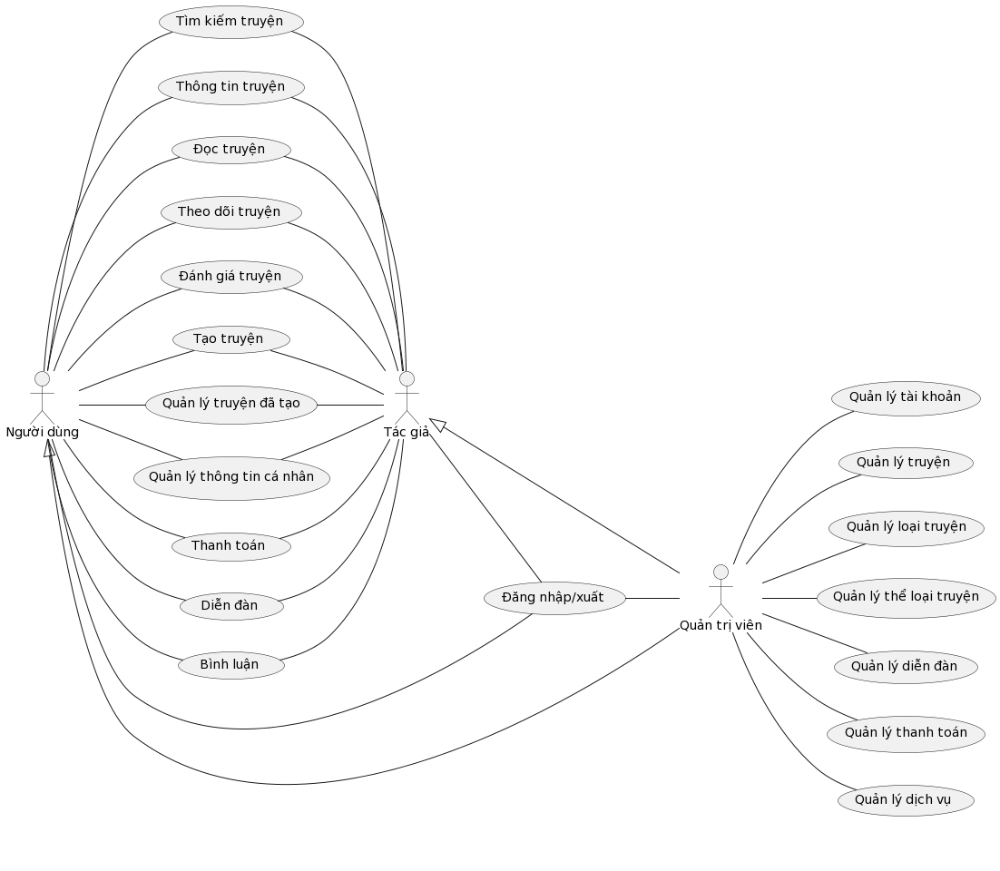
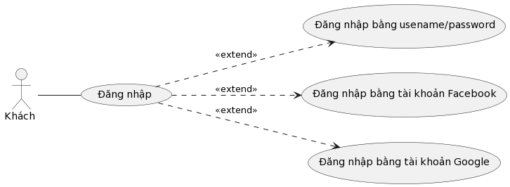
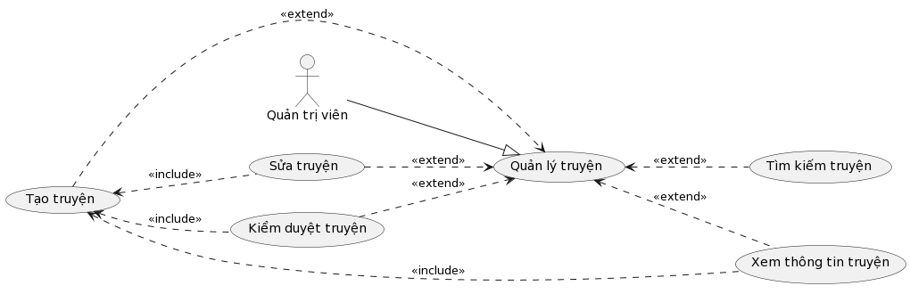
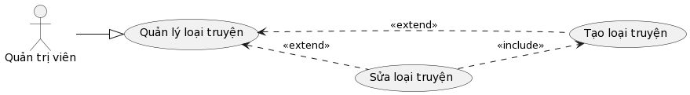
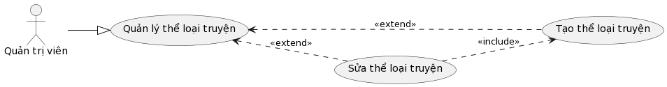
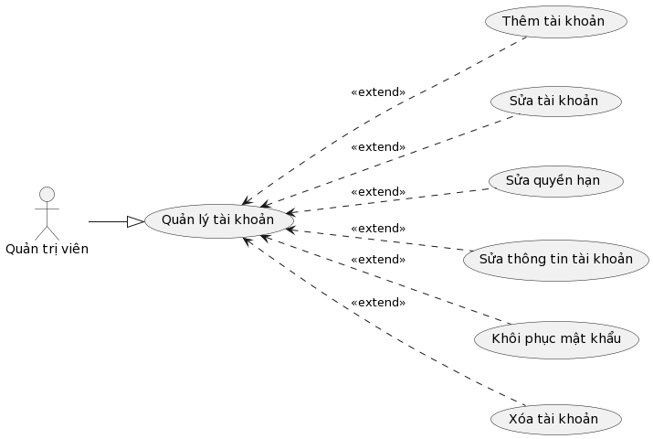

# Phân tích thiết kế hệ thống

## Tổng quát chức năng

### Biểu đồ Use Case tổng quát

### Biểu đồ Use Case phân rã

1.	Đăng nhập

2.	Quản lý thông tin cá nhân

3.	Quản lý truyện đã tạo

4.	Quản lý truyện

5.	Quản lý loại truyện

6.	Quản lý thể loại truyện

7.	Quản lý thanh toán

8.	Quản lý tài khoản

9.	Quản lý diễn đàn

10. Quản lý dịch vụ
